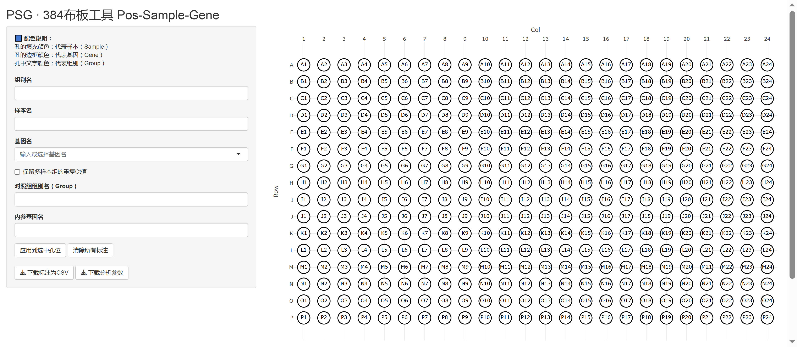

# PGSG_tool

**An R-based tool for visualizing 384-well plate layouts and performing qPCR data analysis**

**用于384孔板可视化布板与qPCR分析的R语言工具**

### **目录**

[1 前言](#1-前言)  

[2 介绍](#2-介绍)  

  [2.1 可视化布板模块](#21-可视化布板模块)  
  
  [2.2 分析模块](#22-分析模块)  
  
[3 使用方法](#3-使用方法以v11说明)  

[4 版本更新](#4-版本更新)  

[5 特别鸣谢](#5-特别鸣谢)

## 1 前言

首先抱歉，本项目是湿实验打工人使用gpt老师辅助编写的R工具，因此我对于代码的细节写法与优化方法并不是完全清晰，在项目管理与说明文档的撰写上也不甚清楚...

代码已在本项目中开源，欢迎大家在此基础上修改、迭代以适配自己的使用需求。

## 2 介绍（以v1.1说明）

PGSG工具可以灵活处理不同布板设计384孔板的qPCR数据，代码主要由 可视化布板模块 + 分析模块 两个部分构成

### 2.1 可视化布板模块

本模块基于`shiny`和`plotly`实现，支持用户通过可视化的交互方式为每孔标注*Group*-组别名、*Sample*-样本名和*Gene*-基因名。主要功能包括：

-   鼠标单击或框选孔位进行批量选择

-   **手动输入*Group*、*Sample*、*Gene*信息**，可以导出`.csv`标注文件至本地，在分析模块中调用；首次输入的信息会作为常用信息暂存在程序中，可以在对应下拉框中找到并选择

-   **手动输入*对照组组别名*和*内参基因名***，可以导出`.txt`参数文件至本地，在分析模块中调用

-   **选择是否保留多样本组的重复ct值**，默认不勾选，即以样本技术重复均值参与计算

-   三重配色方便快速检查布板信息，左侧信息栏对应显示已设置信息的图例

    字体色-*Group*，填充色-*Sample*，边框色-*Gene*

-   光标放置于孔上以悬浮窗显示三类信息，自动提示信息缺失孔位（⚠️）；若三类信息均为空则认为是未使用孔，不提示缺失

示意图：

### 2.2 分析模块

**注意：目前代码仅支持Roche480导出的原始数据格式，若使用其他厂商仪器请自行修改本模块代码！**

本模块支持常规 2\^-ΔΔCt 方法下的全自动 qPCR 数据分析。通过调用原始数据、布板模块生成的 `.csv` 标注文件和 `.txt` 参数文件，用户可一键完成从原始数据处理到结果输出的全流程。主要功能包括：

-   **自动读取并匹配文件内容**：读取用户提供的原始 Ct 数据（.txt 格式），布板标注文件（.csv 格式）与参数文件（.txt 格式），自动完成信息合并与校验

-   **支持单样本组和多样本组自动识别**：

    对于每组仅含1个样本的情况，保留该样本的3个技术重复，便于后续绘制误差棒；

    对于每组包含多个样本的情况，用户可在布板模块中选择是否保留重复值，并在本模块中通过参数文件读取。若勾选保留重复，则每个样本保留3个ct值，逐个参与计算；若未勾选，则对每个样本的ct值先取平均，再参与后续ΔCt、ΔΔCt计算

-   **自动完成 ΔCt、ΔΔCt 与 2\^-ΔΔCt 计算**：

    首先计算每个样本的内参基因 Ct 值均值，并据此得到 ΔCt；

    对照组每个基因的 ΔCt 均值作为 ΔΔCt 的参考值；

    最终计算 ΔΔCt 与 2\^-ΔΔCt 表达量

-   计算结果自动以`.xlsx`文件输出

-   运行过程提示清晰：控制台将输出各步骤状态信息（如数据读取、合并、计算、导出等），便于用户快速排查错误或确认进度

## 3 使用方法（以v1.1说明）

1、使用Rstudio打开代码，运行可视化布板模块（至\"启动app\"注释结束），可见shiny窗口弹出，点击窗口上方\"Open in Browser\"使用浏览器打开

2、完成布板（细节见介绍），导出 `.csv` 标注文件和 `.txt` 参数文件。

**注意：窗口关闭后不会保存布板数据，请及时导出文件！**

3、回到rstudio修改代码分析模块开头`参数文件`、`标注文件`、`原始数据文件`和`输出文件`的路径，运行分析模块，可在输出文件路径找到结果文件

## 4 版本更新

[v1.0（20250416）](./PGSG_V1.0.R)：仅支持每组单样本的常规qpcr，样本的3个ct单独计算以保留误差棒

[v1.1（20250419）](./PGSG_v1.1.R)：支持每组单样本或多样本的常规qpcr，单样本的三次重复强制单独计算以保留误差棒，多样本在PGSG界面可选将每个样本以三次重复或均值进行计算

**尚未发布**\_v2.0（20250516）：支持每组单样本或多样本的常规qpcr和RIP-qpcr，在PGSG界面选择模式后无需在分析代码中手动修改计算方法；常规模式下每组单样本强制保留重复值，每组多样本可选保留重复值或以均值计算；支持RIP模式下隐藏保留重复值选项、内参基因名、对照组别名，组别不可手动输入（Input/IP/IgG三选一）

## 5 特别鸣谢

chatgpt 4O、[2023xxxccc](https://github.com/2023xxxccc)
